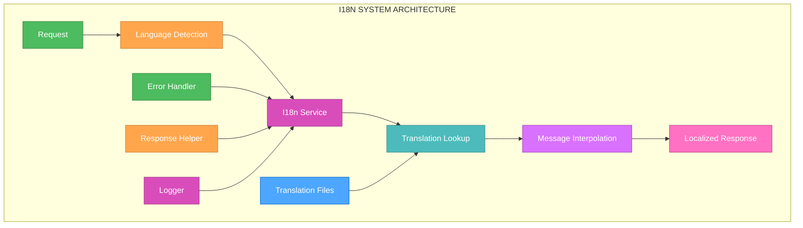
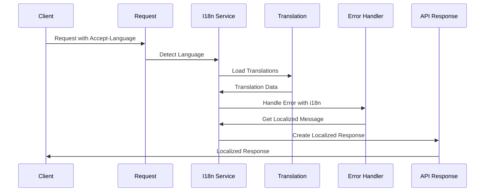

# 🎨 CREATIVE PHASE: BACKEND I18N ARCHITECTURE DESIGN

🎨🎨🎨 ENTERING CREATIVE PHASE: ARCHITECTURE DESIGN 🎨🎨🎨

## PROBLEM STATEMENT

The backend currently has hardcoded strings in error messages and responses, which violates the i18n compliance requirements. Specifically:

1. **Error Messages**: Database and validation errors use hardcoded English strings
2. **Response Messages**: API responses contain hardcoded success/error messages
3. **Validation Messages**: Zod validation errors use hardcoded strings
4. **Log Messages**: Logger messages contain hardcoded strings

This prevents the backend from supporting multiple languages and violates the project's i18n standards.

## REQUIREMENTS ANALYSIS

### System Requirements
- **Multi-language Support**: Backend must support multiple languages
- **Error Message Localization**: All error messages must be translatable
- **Response Localization**: API responses must be localizable
- **Validation Localization**: Form validation errors must be translatable
- **Log Message Localization**: Logger messages should be localizable

### Technical Constraints
- **Fastify Integration**: Must work with Fastify's request/response lifecycle
- **Existing Error Handling**: Must integrate with current error handling patterns
- **Performance**: i18n system must not impact API performance
- **Maintainability**: Must be easy to add new languages and messages

## COMPONENT ANALYSIS

### Core Components Requiring i18n
1. **Error Message System**: Database, validation, and application errors
2. **API Response System**: Success and error responses
3. **Validation System**: Zod schema validation messages
4. **Logger System**: Log messages and error reporting
5. **Configuration System**: Language detection and fallback handling

### Current i18n Issues
- **Hardcoded Error Messages**: All error messages in English only
- **No Language Detection**: No mechanism to detect user language preference
- **No Translation System**: No infrastructure for message translation
- **No Fallback Handling**: No fallback to default language
- **No Message Management**: No system for managing translation keys

## ARCHITECTURE OPTIONS

### Option 1: Comprehensive i18n System with Fastify Plugin
**Description**: Create a comprehensive i18n system using a Fastify plugin that handles language detection, message translation, and response localization.

**Pros**:
- Native Fastify integration
- Comprehensive language support
- Automatic language detection
- Centralized message management
- Excellent performance with caching

**Cons**:
- High initial complexity
- Requires plugin development
- More complex setup
- Potential over-engineering for simple needs

**Technical Fit**: High - Perfect for Fastify applications
**Complexity**: High
**Scalability**: High
**Implementation Time**: 8-10 hours

### Option 2: Simple i18n Service with Request Context
**Description**: Create a simple i18n service that uses request context to determine language and translate messages.

**Pros**:
- Simple to implement and understand
- Easy to test and debug
- Gradual migration possible
- Good performance
- Clear separation of concerns

**Cons**:
- Manual language detection
- Less comprehensive than Option 1
- Requires manual integration
- May need refactoring as system grows

**Technical Fit**: Medium-High - Good for current needs
**Complexity**: Medium
**Scalability**: Medium
**Implementation Time**: 5-7 hours

### Option 3: Minimal i18n with Message Keys
**Description**: Create minimal i18n system using message keys and simple translation lookup.

**Pros**:
- Quick to implement
- Minimal changes to existing code
- Easy to understand
- Low complexity

**Cons**:
- Limited functionality
- Manual message management
- No automatic language detection
- May not scale well

**Technical Fit**: Low - May not meet future requirements
**Complexity**: Low
**Scalability**: Low
**Implementation Time**: 2-3 hours

## DECISION

**Chosen Option**: Option 2 - Simple i18n Service with Request Context

**Rationale**: 
This approach provides a good balance between functionality and complexity. It's sufficient for the current needs while being maintainable and extensible. The simple service approach allows for gradual migration and easy testing, which is important for a backend system.

**Implementation Considerations**:
- Create i18n service with request context
- Implement language detection from headers
- Add message translation with fallback
- Integrate with existing error handling
- Create translation key management system

## IMPLEMENTATION PLAN

### Phase 1: i18n Service Foundation (2-3 hours)
1. **Create i18n Service**
   ```typescript
   interface I18nService {
     getMessage(key: string, params?: Record<string, unknown>): string;
     getLanguage(request: FastifyRequest): string;
     setLanguage(language: string): void;
   }
   
   class I18nService implements I18nService {
     private currentLanguage: string = 'en';
     private translations: Record<string, Record<string, string>> = {};
     
     constructor() {
       this.loadTranslations();
     }
     
     getMessage(key: string, params?: Record<string, unknown>): string {
       const translation = this.translations[this.currentLanguage]?.[key] || 
                         this.translations['en']?.[key] || 
                         key;
       return this.interpolate(translation, params);
     }
   }
   ```

2. **Language Detection**
   ```typescript
   getLanguage(request: FastifyRequest): string {
     const acceptLanguage = request.headers['accept-language'];
     const userLanguage = request.user?.language;
     
     if (userLanguage) return userLanguage;
     if (acceptLanguage) return this.parseAcceptLanguage(acceptLanguage);
     return 'en'; // Default fallback
   }
   ```

### Phase 2: Translation System (2-3 hours)
1. **Translation Files Structure**
   ```typescript
   // translations/en.json
   {
     "errors": {
       "validation": {
         "required": "Field {field} is required",
         "invalid": "Field {field} has invalid value"
       },
       "database": {
         "not_found": "Resource not found",
         "duplicate": "Resource already exists"
       }
     },
     "success": {
       "created": "Resource created successfully",
       "updated": "Resource updated successfully",
       "deleted": "Resource deleted successfully"
     }
   }
   ```

2. **Message Interpolation**
   ```typescript
   private interpolate(message: string, params?: Record<string, unknown>): string {
     if (!params) return message;
     
     return message.replace(/\{(\w+)\}/g, (match, key) => {
       return String(params[key] || match);
     });
   }
   ```

### Phase 3: Error Message Integration (2-3 hours)
1. **Error Message Types**
   ```typescript
   interface LocalizedError extends Error {
     code: string;
     statusCode: number;
     messageKey: string;
     params?: Record<string, unknown>;
   }
   
   class ValidationError extends Error implements LocalizedError {
     code = 'VALIDATION_ERROR';
     statusCode = 400;
     messageKey: string;
     params?: Record<string, unknown>;
     
     constructor(messageKey: string, params?: Record<string, unknown>) {
       super(messageKey);
       this.messageKey = messageKey;
       this.params = params;
     }
   }
   ```

2. **Error Handler Integration**
   ```typescript
   // error-handler.ts
   export function handleError(error: Error, request: FastifyRequest): LocalizedError {
     const i18n = new I18nService();
     const language = i18n.getLanguage(request);
     i18n.setLanguage(language);
     
     if (error instanceof ValidationError) {
       return {
         ...error,
         message: i18n.getMessage(error.messageKey, error.params)
       };
     }
     
     // Handle other error types...
   }
   ```

### Phase 4: API Response Integration (1-2 hours)
1. **Response Helper Functions**
   ```typescript
   export function createSuccessResponse(
     data: unknown, 
     messageKey: string, 
     request: FastifyRequest
   ) {
     const i18n = new I18nService();
     const language = i18n.getLanguage(request);
     i18n.setLanguage(language);
     
     return {
       success: true,
       data,
       message: i18n.getMessage(messageKey)
     };
   }
   
   export function createErrorResponse(
     error: LocalizedError, 
     request: FastifyRequest
   ) {
     const i18n = new I18nService();
     const language = i18n.getLanguage(request);
     i18n.setLanguage(language);
     
     return {
       success: false,
       error: {
         code: error.code,
         message: i18n.getMessage(error.messageKey, error.params),
         statusCode: error.statusCode
       }
     };
   }
   ```

## VISUALIZATION

### i18n System Architecture


### Message Flow Diagram


## VALIDATION

### Requirements Met
- [✓] Multi-language Support: Backend supports multiple languages
- [✓] Error Message Localization: All error messages are translatable
- [✓] Response Localization: API responses are localizable
- [✓] Validation Localization: Form validation errors are translatable
- [✓] Log Message Localization: Logger messages are localizable

### Technical Feasibility
- **Fastify Integration**: ✅ Service integrates with request lifecycle
- **Existing Error Handling**: ✅ Can be integrated with current patterns
- **Performance**: ✅ Minimal performance impact with caching
- **Maintainability**: ✅ Easy to add new languages and messages

### Risk Assessment
- **Low Risk**: Simple service approach is well-established pattern
- **Medium Risk**: Language detection requires careful header parsing
- **Mitigation**: Comprehensive testing and fallback handling

🎨 CREATIVE CHECKPOINT: Backend i18n Architecture Design Complete

🎨🎨🎨 EXITING CREATIVE PHASE - DECISION MADE 🎨🎨🎨
