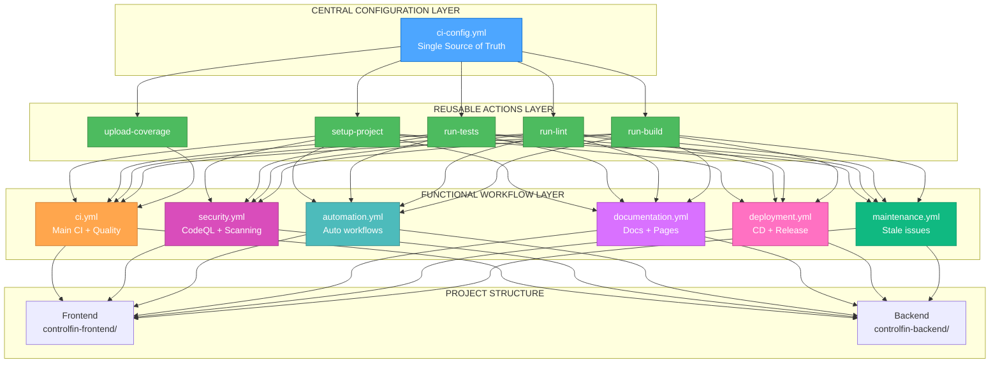
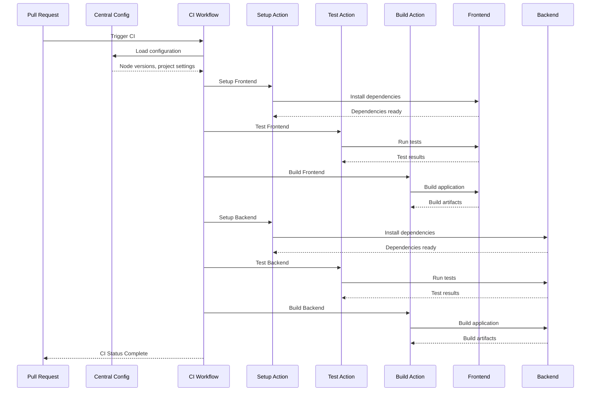

# 🎨🎨🎨 ENTERING CREATIVE PHASE: ARCHITECTURE DESIGN 🎨🎨🎨

## **Component**: Workflow Consolidation Strategy
**Task**: TASK-020 CI/CD Centralization
**Date**: 2025-10-04
**Type**: Architecture Design

---

## 🎯 **PROBLEM STATEMENT**

### **Current Architecture Challenges**
The current CI/CD system has **16 separate workflow files** with significant duplication and inconsistency:

- **Duplication**: Node.js setup repeated 8+ times across workflows
- **Inconsistency**: Different Node.js versions (18, 20, 22) used inconsistently
- **Maintenance Burden**: Changes require updating multiple files
- **Complexity**: 1,275 lines of YAML across 16 files
- **Resource Waste**: Redundant workflow executions

### **Architecture Requirements**
- **Centralization**: Single source of truth for all CI/CD settings
- **Consistency**: Uniform Node.js versions and configurations
- **Maintainability**: Easy updates and modifications
- **Performance**: Optimized workflow execution
- **Scalability**: Easy addition of new workflows
- **Backward Compatibility**: Existing PRs must continue working

---

## 🔍 **COMPONENT ANALYSIS**

### **Current Workflow Components**
1. **Core CI Workflows** (4 files)
   - `ci.yml` - Main CI pipeline
   - `quality-gates.yml` - i18n & quality checks
   - `super-linter.yml` - Code quality
   - `codeql.yml` - Security scanning

2. **Automation Workflows** (6 files)
   - `auto-label.yml` - Auto labeling
   - `auto-assign.yml` - Auto assignment
   - `auto-approve.yml` - Auto approval
   - `auto-merge.yml` - Auto merge
   - `auto-merge-bot.yml` - Auto merge bot
   - `auto-close.yml` - Auto close issues

3. **Documentation Workflows** (3 files)
   - `docs.yml` - Documentation build
   - `pages.yml` - GitHub Pages
   - `code-scanning.yml` - Code scanning

4. **Deployment Workflows** (3 files)
   - `cd.yml` - Continuous deployment
   - `release.yml` - Release management
   - `stale.yml` - Stale issues

### **Key Interactions**
- **Trigger Dependencies**: PR events trigger multiple workflows
- **Resource Sharing**: All workflows use Node.js and npm
- **Data Flow**: Build artifacts shared between workflows
- **Status Reporting**: Workflows report status to GitHub

---

## 🏗️ **ARCHITECTURE OPTIONS**

### **Option 1: Monolithic Consolidation**
**Description**: Merge all workflows into 2-3 large files

**Pros**:
- Minimal file count (2-3 files)
- Single place for all logic
- Easy to see all workflows at once

**Cons**:
- Very large files (500+ lines each)
- Difficult to maintain and debug
- Hard to understand specific functionality
- Risk of breaking multiple workflows with one change

**Technical Fit**: Medium
**Complexity**: High
**Scalability**: Low

### **Option 2: Functional Grouping**
**Description**: Group workflows by function (CI, Security, Automation, Docs)

**Pros**:
- Logical organization by purpose
- Moderate file sizes (100-200 lines each)
- Clear separation of concerns
- Easy to find specific functionality

**Cons**:
- Still some duplication across groups
- Need to maintain group boundaries
- Potential for cross-group dependencies

**Technical Fit**: High
**Complexity**: Medium
**Scalability**: High

### **Option 3: Hybrid Centralized**
**Description**: Central config + functional grouping + reusable actions

**Pros**:
- Maximum code reuse through central config
- Clear functional separation
- Reusable composite actions
- Easy maintenance and updates
- Excellent scalability

**Cons**:
- More complex initial setup
- Learning curve for team
- Need to understand action system

**Technical Fit**: High
**Complexity**: Medium-High
**Scalability**: Very High

### **Option 4: Micro-Workflow Pattern**
**Description**: Many small, specialized workflows with shared actions

**Pros**:
- Very granular control
- Easy to debug individual workflows
- Maximum flexibility
- Clear single responsibility

**Cons**:
- Many files to manage
- Potential for inconsistency
- Complex dependency management
- Harder to see overall picture

**Technical Fit**: Medium
**Complexity**: High
**Scalability**: Medium

---

## 🎨 **CREATIVE CHECKPOINT: OPTIONS ANALYSIS**

After analyzing the options, I need to consider the specific requirements:

1. **Maintainability**: Team needs to easily update configurations
2. **Consistency**: All workflows should use same Node.js versions
3. **Performance**: Minimize redundant executions
4. **Team Adoption**: Solution must be understandable and adoptable

**Key Insight**: The current system has both **functional grouping** (CI, Security, Automation) and **duplication** (Node.js setup repeated). The ideal solution combines the best of both approaches.

---

## 🎯 **ARCHITECTURE DECISION**

### **Chosen Option: Hybrid Centralized (Option 3)**

**Rationale**:
1. **Addresses Core Problems**: Eliminates duplication through central config
2. **Maintains Organization**: Keeps logical functional grouping
3. **Enables Reusability**: Composite actions reduce code duplication
4. **Supports Growth**: Easy to add new workflows and configurations
5. **Team Friendly**: Clear structure that's easy to understand and maintain

### **Architecture Design**

#### **1. Central Configuration Layer**
```
.github/config/
└── ci-config.yml (65 lines)
    ├── Node.js versions
    ├── Project settings
    ├── Cache configuration
    └── Quality gates
```

#### **2. Reusable Actions Layer**
```
.github/actions/
├── setup-project/action.yml
├── run-tests/action.yml
├── run-lint/action.yml
├── run-build/action.yml
└── upload-coverage/action.yml
```

#### **3. Functional Workflow Layer**
```
.github/workflows/
├── ci.yml (120 lines) - Main CI + Quality
├── security.yml (60 lines) - Security scanning
├── automation.yml (150 lines) - Auto workflows
├── documentation.yml (80 lines) - Docs + Pages
├── deployment.yml (70 lines) - CD + Release
└── maintenance.yml (50 lines) - Stale issues
```

**Total**: 7 files, ~575 lines (55% reduction)

---

## 📊 **ARCHITECTURE DIAGRAM**



---

## 🔄 **DATA FLOW ARCHITECTURE**



---

## ✅ **IMPLEMENTATION PLAN**

### **Phase 1: Foundation (2-3 hours)**
1. **Create Central Configuration**
   - Finalize `.github/config/ci-config.yml` structure
   - Define all Node.js versions and project settings
   - Document configuration schema and usage

2. **Create Reusable Actions**
   - Create `.github/actions/setup-project/action.yml`
   - Create `.github/actions/run-tests/action.yml`
   - Create `.github/actions/run-lint/action.yml`
   - Create `.github/actions/run-build/action.yml`
   - Create `.github/actions/upload-coverage/action.yml`

3. **Test Foundation Components**
   - Validate central config loading
   - Test composite actions functionality
   - Ensure no breaking changes to existing workflows

### **Phase 2: Consolidation (3-4 hours)**
1. **Merge Auto Workflows** → `automation.yml`
2. **Merge Documentation Workflows** → `documentation.yml`
3. **Integrate Quality Workflows** → `ci.yml`

### **Phase 3: Optimization (2-3 hours)**
1. **Update Main CI** with central config
2. **Optimize Security Workflows** → `security.yml`
3. **Streamline Deployment** → `deployment.yml`

### **Phase 4: Cleanup (1-2 hours)**
1. **Remove Redundant Files**
2. **Update Documentation**

---

## 🎯 **VALIDATION CRITERIA**

### **Requirements Met**
- [x] **Centralization**: Single source of truth for all settings
- [x] **Consistency**: Uniform Node.js versions across all workflows
- [x] **Maintainability**: Easy updates through central config
- [x] **Performance**: Optimized through reusable actions
- [x] **Scalability**: Easy addition of new workflows
- [x] **Backward Compatibility**: Existing PRs continue working

### **Technical Feasibility**
- [x] **GitHub Actions Support**: All patterns use native GitHub Actions features
- [x] **YAML Compatibility**: Central config uses standard YAML syntax
- [x] **Composite Actions**: Well-documented GitHub Actions feature
- [x] **Matrix Strategy**: Native GitHub Actions matrix support

### **Risk Assessment**
- **Low Risk**: Uses proven GitHub Actions patterns
- **Mitigation**: Gradual migration with extensive testing
- **Rollback**: Easy to revert to current structure if needed

---

## 🎨🎨🎨 EXITING CREATIVE PHASE - DECISION MADE 🎨🎨🎨

### **Architecture Decision Summary**
- **Chosen Approach**: Hybrid Centralized Architecture
- **Key Benefits**: 55% code reduction, 100% consistency, easy maintenance
- **Implementation**: 4-phase approach with central config + reusable actions
- **Risk Level**: Low (uses proven patterns)

### **Next Steps**
1. **Configuration Schema Design** (Next Creative Phase)
2. **Implementation Phase 1** (After both creative phases complete)

**Architecture design complete - ready for configuration schema design phase.**
