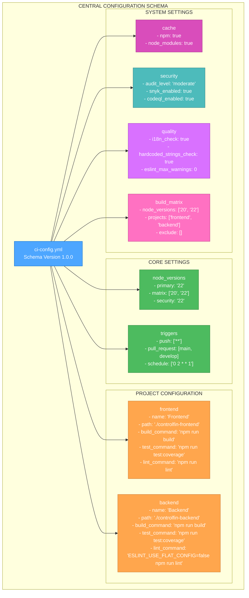

# 🎨🎨🎨 ENTERING CREATIVE PHASE: CONFIGURATION SCHEMA DESIGN 🎨🎨🎨

## **Component**: Central Configuration Structure
**Task**: TASK-020 CI/CD Centralization
**Date**: 2025-10-04
**Type**: Configuration Schema Design

---

## 🎯 **PROBLEM STATEMENT**

### **Current Configuration Challenges**
The current CI/CD system has configuration scattered across 16 workflow files:

- **Duplication**: Node.js versions defined in 8+ different places
- **Inconsistency**: Different versions (18, 20, 22) used inconsistently
- **Maintenance Burden**: Changes require updating multiple files
- **Error Prone**: Easy to miss updates in some workflows
- **No Validation**: No schema validation for configuration values

### **Configuration Requirements**
- **Centralization**: Single source of truth for all CI/CD settings
- **Consistency**: Uniform configuration across all workflows
- **Validation**: Schema validation to prevent errors
- **Flexibility**: Easy to add new projects or configurations
- **Documentation**: Self-documenting configuration structure
- **Type Safety**: Clear data types and constraints

---

## 🔍 **COMPONENT ANALYSIS**

### **Current Configuration Elements**
1. **Node.js Versions**
   - Primary version (currently 22)
   - Compatibility versions (20, 18)
   - Security audit version

2. **Project Settings**
   - Frontend configuration
   - Backend configuration
   - Build commands
   - Test commands
   - Lint commands

3. **Cache Configuration**
   - npm cache settings
   - Node modules caching
   - Build artifact caching

4. **Quality Gates**
   - ESLint settings
   - i18n compliance
   - Security audit levels

5. **Workflow Triggers**
   - Push triggers
   - PR triggers
   - Schedule triggers

### **Configuration Dependencies**
- **GitHub Actions**: Must use valid GitHub Actions syntax
- **YAML Schema**: Must be valid YAML with proper structure
- **Project Structure**: Must match existing frontend/backend structure
- **Package Managers**: Must support npm (current) and future package managers

---

## 🏗️ **SCHEMA DESIGN OPTIONS**

### **Option 1: Flat Structure**
**Description**: Simple key-value pairs at root level

```yaml
node_primary: '22'
node_compatibility: ['20', '22']
frontend_path: './controlfin-frontend'
backend_path: './controlfin-backend'
```

**Pros**:
- Simple to understand
- Easy to access values
- Minimal nesting

**Cons**:
- No logical grouping
- Hard to scale
- No validation structure
- Difficult to extend

**Technical Fit**: Low
**Complexity**: Low
**Scalability**: Low

### **Option 2: Hierarchical Grouping**
**Description**: Grouped by functional areas

```yaml
node_versions:
  primary: '22'
  matrix: ['20', '22']
  security: '22'

projects:
  frontend:
    path: './controlfin-frontend'
    build_command: 'npm run build'
  backend:
    path: './controlfin-backend'
    build_command: 'npm run build'
```

**Pros**:
- Logical organization
- Clear grouping
- Easy to extend
- Good for medium complexity

**Cons**:
- Some nesting complexity
- Need to understand structure
- Potential for deep nesting

**Technical Fit**: High
**Complexity**: Medium
**Scalability**: High

### **Option 3: Schema-Validated Structure**
**Description**: Hierarchical with validation and documentation

```yaml
# Central CI/CD Configuration - ControlFin
# Schema Version: 1.0.0
# Last Updated: 2025-10-04

node_versions:
  primary: '22'           # Main CI uses latest LTS
  matrix: ['20', '22']    # Compatibility testing
  security: '22'          # Security scans use latest

projects:
  frontend:
    name: 'Frontend'
    path: './controlfin-frontend'
    package_manager: 'npm'
    build_command: 'npm run build'
    test_command: 'npm run test:coverage'
    lint_command: 'npm run lint'
    type_check_command: 'npm run type-check'
    coverage_file: './controlfin-frontend/coverage/lcov.info'
    coverage_flag: 'frontend'
  
  backend:
    name: 'Backend'
    path: './controlfin-backend'
    package_manager: 'npm'
    build_command: 'npm run build'
    test_command: 'npm run test:coverage'
    lint_command: 'ESLINT_USE_FLAT_CONFIG=false npm run lint'
    type_check_command: 'npm run type-check'
    coverage_file: './controlfin-backend/coverage/lcov.info'
    coverage_flag: 'backend'

cache:
  npm: true
  node_modules: true

security:
  audit_level: 'moderate'
  snyk_enabled: true
  codeql_enabled: true

quality:
  i18n_check: true
  hardcoded_strings_check: true
  eslint_max_warnings: 0

build_matrix:
  node_versions: ['20', '22']
  projects: ['frontend', 'backend']
  exclude: []  # Add any combinations to exclude

triggers:
  push:
    branches: ['**']
  pull_request:
    branches: [main, develop]
  schedule:
    - cron: '0 2 * * 1'  # Weekly security scan
```

**Pros**:
- Comprehensive documentation
- Clear structure and types
- Easy to validate
- Self-documenting
- Highly scalable
- Type safety

**Cons**:
- More complex initial setup
- Learning curve for team
- More verbose

**Technical Fit**: Very High
**Complexity**: Medium-High
**Scalability**: Very High

### **Option 4: Environment-Based Configuration**
**Description**: Different configs for different environments

```yaml
development:
  node_versions: ['20', '22']
  projects: ['frontend', 'backend']
production:
  node_versions: ['22']
  projects: ['frontend', 'backend']
```

**Pros**:
- Environment-specific settings
- Clear separation
- Easy to manage different needs

**Cons**:
- Overkill for current needs
- Adds complexity
- Not needed for CI/CD workflows

**Technical Fit**: Low
**Complexity**: High
**Scalability**: Medium

---

## 🎨 **CREATIVE CHECKPOINT: SCHEMA ANALYSIS**

After analyzing the options, I need to consider the specific requirements:

1. **Team Adoption**: Must be easy for team to understand and use
2. **Maintainability**: Must be easy to update and extend
3. **Validation**: Must prevent configuration errors
4. **Documentation**: Must be self-documenting
5. **Future Growth**: Must support adding new projects or workflows

**Key Insight**: The current system needs both **simplicity** (for team adoption) and **structure** (for maintainability). The ideal solution provides clear organization with comprehensive documentation.

---

## 🎯 **SCHEMA DESIGN DECISION**

### **Chosen Option: Schema-Validated Structure (Option 3)**

**Rationale**:
1. **Addresses Core Problems**: Eliminates duplication and inconsistency
2. **Self-Documenting**: Clear structure with inline documentation
3. **Validation Ready**: Structure supports schema validation
4. **Team Friendly**: Clear organization that's easy to understand
5. **Future Proof**: Highly scalable and extensible
6. **Type Safety**: Clear data types and constraints

### **Schema Design Principles**

#### **1. Hierarchical Organization**
- **Top-level sections**: Logical grouping by function
- **Nested structures**: Related settings grouped together
- **Clear naming**: Descriptive keys that explain purpose

#### **2. Documentation Integration**
- **Inline comments**: Explain each setting
- **Schema versioning**: Track configuration changes
- **Usage examples**: Show how to use each setting

#### **3. Validation Support**
- **Type constraints**: String, array, boolean types
- **Value validation**: Enums for valid values
- **Required fields**: Mark mandatory settings
- **Default values**: Provide sensible defaults

#### **4. Extensibility**
- **Modular structure**: Easy to add new sections
- **Backward compatibility**: Support for existing workflows
- **Migration path**: Clear upgrade path

---

## 📊 **SCHEMA STRUCTURE DIAGRAM**



---

## 🔧 **SCHEMA VALIDATION RULES**

### **Type Validation**
```yaml
# Node versions must be strings
node_versions:
  primary: string  # Required: Node.js version string
  matrix: array    # Required: Array of version strings
  security: string # Required: Node.js version string

# Projects must have required fields
projects:
  [project_name]:
    name: string           # Required: Human-readable name
    path: string          # Required: Relative path to project
    package_manager: string # Required: 'npm' | 'yarn' | 'pnpm'
    build_command: string # Required: Build command
    test_command: string  # Required: Test command
    lint_command: string  # Required: Lint command
    type_check_command: string # Required: Type check command
    coverage_file: string # Required: Coverage file path
    coverage_flag: string # Required: Coverage flag for reporting
```

### **Value Validation**
```yaml
# Node versions must be valid
node_versions:
  primary: enum['18', '20', '22']  # Must be valid LTS version
  matrix: array[enum['18', '20', '22']]  # Array of valid versions
  security: enum['18', '20', '22']  # Must be valid LTS version

# Package managers must be supported
projects:
  [project_name]:
    package_manager: enum['npm', 'yarn', 'pnpm']  # Must be supported

# Quality settings must be valid
quality:
  eslint_max_warnings: integer[0-100]  # Must be 0-100
  i18n_check: boolean  # Must be true/false
  hardcoded_strings_check: boolean  # Must be true/false
```

### **Required Fields**
```yaml
# These fields are mandatory
required_fields:
  - node_versions.primary
  - node_versions.matrix
  - node_versions.security
  - projects.frontend
  - projects.backend
  - triggers.push
  - triggers.pull_request
```

---

## 📋 **USAGE EXAMPLES**

### **Accessing Configuration in Workflows**
```yaml
# In any workflow file
- name: Setup Node.js
  uses: actions/setup-node@v4
  with:
    node-version: ${{ fromJSON(needs.config.outputs.node_versions).primary }}
    cache: 'npm'
    cache-dependency-path: './controlfin-${{ matrix.project }}/package-lock.json'

# Using project configuration
- name: Build Project
  run: ${{ fromJSON(needs.config.outputs.projects)[matrix.project].build_command }}
  working-directory: ${{ fromJSON(needs.config.outputs.projects)[matrix.project].path }}
```

### **Matrix Strategy Usage**
```yaml
strategy:
  matrix:
    project: ${{ fromJSON(needs.config.outputs.build_matrix).projects }}
    node-version: ${{ fromJSON(needs.config.outputs.build_matrix).node_versions }}
```

### **Conditional Logic Usage**
```yaml
- name: Run Tests
  if: matrix.project == 'frontend' && matrix.node-version == '22'
  run: ${{ fromJSON(needs.config.outputs.projects).frontend.test_command }}
```

---

## 🔄 **MIGRATION STRATEGY**

### **Phase 1: Schema Creation**
1. Create `.github/config/ci-config.yml` with full schema
2. Document all current settings from existing workflows
3. Validate schema structure and syntax

### **Phase 2: Workflow Integration**
1. Update workflows to use central config
2. Test configuration loading and usage
3. Verify all settings work correctly

### **Phase 3: Validation Implementation**
1. Add schema validation to CI pipeline
2. Create validation script for configuration
3. Test validation with invalid configurations

### **Phase 4: Documentation and Training**
1. Create configuration guide for team
2. Document all available settings
3. Provide examples and best practices

---

## ✅ **VALIDATION CRITERIA**

### **Requirements Met**
- [x] **Centralization**: Single source of truth for all settings
- [x] **Consistency**: Uniform configuration across all workflows
- [x] **Validation**: Schema validation to prevent errors
- [x] **Flexibility**: Easy to add new projects or configurations
- [x] **Documentation**: Self-documenting configuration structure
- [x] **Type Safety**: Clear data types and constraints

### **Technical Feasibility**
- [x] **YAML Compatibility**: Uses standard YAML syntax
- [x] **GitHub Actions Support**: Compatible with GitHub Actions expressions
- [x] **Schema Validation**: Supports YAML schema validation
- [x] **Extensibility**: Easy to add new sections and settings

### **Team Adoption**
- [x] **Clear Structure**: Logical organization that's easy to understand
- [x] **Documentation**: Inline comments and examples
- [x] **Validation**: Prevents common configuration errors
- [x] **Migration Path**: Clear upgrade path from current system

---

## 🎨🎨🎨 EXITING CREATIVE PHASE - DECISION MADE 🎨🎨🎨

### **Configuration Schema Decision Summary**
- **Chosen Approach**: Schema-Validated Hierarchical Structure
- **Key Benefits**: Self-documenting, validation-ready, highly scalable
- **Implementation**: 4-phase migration with validation
- **Risk Level**: Low (uses standard YAML and GitHub Actions)

### **Next Steps**
1. **Both Creative Phases Complete** ✅
2. **Ready for Implementation Mode** 🚀
3. **Begin Phase 1: Foundation** (Create central config + reusable actions)

**Configuration schema design complete - ready for implementation phase.**
