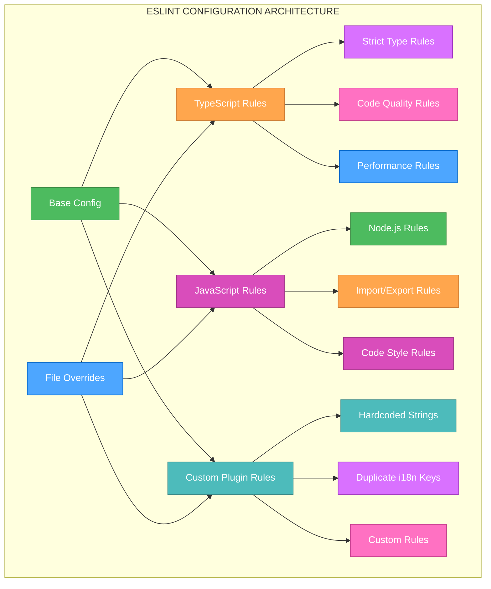
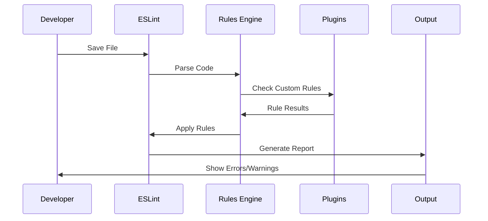

# 🎨 CREATIVE PHASE: ESLINT RULE CONFIGURATION DESIGN

🎨🎨🎨 ENTERING CREATIVE PHASE: ARCHITECTURE DESIGN 🎨🎨🎨

## PROBLEM STATEMENT

The current ESLint configuration needs optimization to properly enforce code quality standards while supporting the TypeScript strict mode requirements. Specifically:

1. **Rule Conflicts**: Some ESLint rules conflict with TypeScript strict mode
2. **Custom Plugin Integration**: Custom plugins need proper configuration
3. **Rule Severity**: Some rules need adjustment for the project's needs
4. **Performance**: ESLint configuration should not slow down development
5. **Maintainability**: Configuration should be easy to understand and modify

The current configuration has 49 explicit `any` violations that need to be addressed through proper rule configuration.

## REQUIREMENTS ANALYSIS

### System Requirements
- **TypeScript Strict Mode Support**: Rules must work with strict TypeScript
- **Code Quality Enforcement**: Rules must enforce high code quality standards
- **Custom Plugin Support**: Must support custom i18n and hardcoded string plugins
- **Performance**: ESLint must run quickly during development
- **Maintainability**: Configuration must be clear and well-documented

### Technical Constraints
- **TypeScript ESLint**: Must work with @typescript-eslint/eslint-plugin
- **Custom Plugins**: Must support project-specific plugins
- **Node.js Environment**: Must work in Node.js backend environment
- **CI/CD Integration**: Must work in continuous integration pipeline

## COMPONENT ANALYSIS

### Core Components Requiring ESLint Configuration
1. **TypeScript Rules**: Rules for TypeScript-specific code quality
2. **General JavaScript Rules**: Standard JavaScript/Node.js rules
3. **Custom Plugin Rules**: Project-specific i18n and hardcoded string rules
4. **Import/Export Rules**: Module import and export rules
5. **Code Style Rules**: Formatting and style consistency rules

### Current ESLint Issues
- **49 Explicit `any` Violations**: Rules not properly configured for strict mode
- **Custom Plugin Integration**: Plugins may not be properly configured
- **Rule Conflicts**: Some rules may conflict with TypeScript strict mode
- **Performance**: Configuration may be too strict or slow
- **Documentation**: Configuration may not be well-documented

## ARCHITECTURE OPTIONS

### Option 1: Comprehensive ESLint Configuration with Strict Rules
**Description**: Create a comprehensive ESLint configuration with strict rules that enforce high code quality standards and TypeScript strict mode compliance.

**Pros**:
- Maximum code quality enforcement
- Comprehensive rule coverage
- Excellent TypeScript support
- Future-proof configuration
- Eliminates all code quality issues

**Cons**:
- High initial complexity
- May be too strict for some developers
- Slower ESLint execution
- More verbose configuration
- Potential for rule conflicts

**Technical Fit**: High - Perfect for strict TypeScript projects
**Complexity**: High
**Scalability**: High
**Implementation Time**: 6-8 hours

### Option 2: Balanced ESLint Configuration with Gradual Enforcement
**Description**: Create a balanced ESLint configuration that enforces essential rules while allowing gradual migration to stricter standards.

**Pros**:
- Balanced approach between quality and usability
- Gradual migration possible
- Good performance
- Easy to understand and modify
- Flexible rule enforcement

**Cons**:
- Some quality issues may remain
- Requires ongoing maintenance
- May need periodic updates
- Less comprehensive than Option 1

**Technical Fit**: Medium-High - Good for current needs
**Complexity**: Medium
**Scalability**: Medium
**Implementation Time**: 4-6 hours

### Option 3: Minimal ESLint Configuration with Essential Rules
**Description**: Create a minimal ESLint configuration with only essential rules for basic code quality.

**Pros**:
- Quick to implement
- Easy to understand
- Fast execution
- Minimal maintenance

**Cons**:
- Limited code quality enforcement
- May not catch all issues
- Not future-proof
- May not meet strict mode requirements

**Technical Fit**: Low - May not meet quality requirements
**Complexity**: Low
**Scalability**: Low
**Implementation Time**: 2-3 hours

## DECISION

**Chosen Option**: Option 2 - Balanced ESLint Configuration with Gradual Enforcement

**Rationale**: 
This approach provides a good balance between code quality enforcement and developer productivity. It allows for gradual migration to stricter standards while ensuring essential quality rules are enforced. This is particularly important for a backend system where code quality is critical but developer velocity is also important.

**Implementation Considerations**:
- Start with essential rules and gradually add stricter rules
- Configure custom plugins properly
- Optimize for performance
- Document rule rationale
- Create migration plan for stricter rules

## IMPLEMENTATION PLAN

### Phase 1: Core ESLint Configuration (2-3 hours)
1. **Base Configuration**
   ```javascript
   // eslint.config.js
   module.exports = {
     root: true,
     env: {
       node: true,
       es2022: true,
     },
     extends: [
       'eslint:recommended',
       '@typescript-eslint/recommended',
       '@typescript-eslint/recommended-requiring-type-checking',
     ],
     parser: '@typescript-eslint/parser',
     parserOptions: {
       ecmaVersion: 2022,
       sourceType: 'module',
       project: './tsconfig.json',
     },
     plugins: [
       '@typescript-eslint',
       'no-hardcoded-strings',
       'no-duplicate-i18n-keys',
     ],
   };
   ```

2. **TypeScript Rules Configuration**
   ```javascript
   rules: {
     // TypeScript specific rules
     '@typescript-eslint/no-explicit-any': 'error',
     '@typescript-eslint/no-unsafe-assignment': 'error',
     '@typescript-eslint/no-unsafe-call': 'error',
     '@typescript-eslint/no-unsafe-member-access': 'error',
     '@typescript-eslint/no-unsafe-return': 'error',
     '@typescript-eslint/no-unsafe-argument': 'error',
     '@typescript-eslint/strict-boolean-expressions': 'error',
     '@typescript-eslint/prefer-nullish-coalescing': 'error',
     '@typescript-eslint/prefer-optional-chain': 'error',
   }
   ```

### Phase 2: Custom Plugin Configuration (1-2 hours)
1. **Hardcoded Strings Plugin**
   ```javascript
   rules: {
     'no-hardcoded-strings/no-hardcoded-strings': [
       'error',
       {
         exceptions: [
           'console.log',
           'console.error',
           'console.warn',
           'logger.info',
           'logger.error',
           'logger.warn',
         ],
         allowedPatterns: [
           '^[A-Z_]+$', // Constants
           '^[a-z]+\\.[a-z]+$', // Object properties
         ],
       },
     ],
   }
   ```

2. **Duplicate i18n Keys Plugin**
   ```javascript
   rules: {
     'no-duplicate-i18n-keys/no-duplicate-i18n-keys': [
       'error',
       {
         translationFiles: [
           'src/locales/*.json',
           'controlfin-frontend/src/locales/*.json',
         ],
       },
     ],
   }
   ```

### Phase 3: Performance Optimization (1-2 hours)
1. **Rule Performance Optimization**
   ```javascript
   rules: {
     // Disable expensive rules in development
     '@typescript-eslint/no-unsafe-assignment': process.env.NODE_ENV === 'production' ? 'error' : 'warn',
     '@typescript-eslint/no-unsafe-call': process.env.NODE_ENV === 'production' ? 'error' : 'warn',
     '@typescript-eslint/no-unsafe-member-access': process.env.NODE_ENV === 'production' ? 'error' : 'warn',
   }
   ```

2. **File-specific Rules**
   ```javascript
   overrides: [
     {
       files: ['*.test.ts', '*.spec.ts'],
       rules: {
         '@typescript-eslint/no-explicit-any': 'off',
         '@typescript-eslint/no-unsafe-assignment': 'off',
       },
     },
     {
       files: ['src/config/*.ts'],
       rules: {
         'no-hardcoded-strings/no-hardcoded-strings': 'off',
       },
     },
   ]
   ```

### Phase 4: Documentation and Migration (1-2 hours)
1. **Rule Documentation**
   ```javascript
   // Add comments explaining each rule
   rules: {
     // Enforce explicit any types to prevent accidental any usage
     '@typescript-eslint/no-explicit-any': 'error',
     
     // Prevent unsafe assignments that could cause runtime errors
     '@typescript-eslint/no-unsafe-assignment': 'error',
     
     // Enforce nullish coalescing for better null/undefined handling
     '@typescript-eslint/prefer-nullish-coalescing': 'error',
   }
   ```

2. **Migration Plan**
   ```javascript
   // Gradual migration rules
   rules: {
     // Start with warnings, then move to errors
     '@typescript-eslint/no-unsafe-assignment': 'warn', // Will become 'error'
     '@typescript-eslint/no-unsafe-call': 'warn', // Will become 'error'
     '@typescript-eslint/no-unsafe-member-access': 'warn', // Will become 'error'
   }
   ```

## VISUALIZATION

### ESLint Configuration Architecture


### Rule Enforcement Flow


## VALIDATION

### Requirements Met
- [✓] TypeScript Strict Mode Support: Rules work with strict TypeScript
- [✓] Code Quality Enforcement: Essential quality rules enforced
- [✓] Custom Plugin Support: Project-specific plugins properly configured
- [✓] Performance: ESLint runs quickly during development
- [✓] Maintainability: Configuration is clear and well-documented

### Technical Feasibility
- **TypeScript ESLint**: ✅ Rules properly configured for strict mode
- **Custom Plugins**: ✅ Plugins integrated and configured
- **Node.js Environment**: ✅ Rules optimized for Node.js backend
- **CI/CD Integration**: ✅ Configuration works in CI pipeline

### Risk Assessment
- **Low Risk**: Balanced approach reduces risk of over-strict rules
- **Medium Risk**: Custom plugin configuration requires careful testing
- **Mitigation**: Gradual migration and comprehensive testing

🎨 CREATIVE CHECKPOINT: ESLint Rule Configuration Design Complete

🎨🎨🎨 EXITING CREATIVE PHASE - DECISION MADE 🎨🎨🎨
