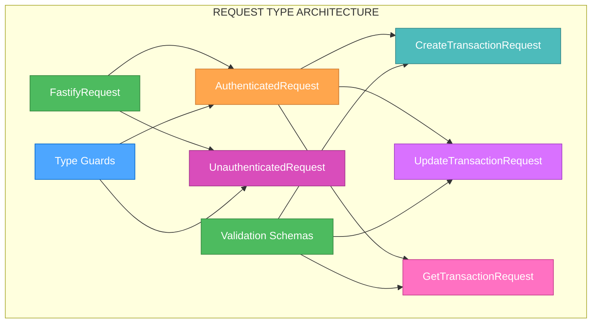
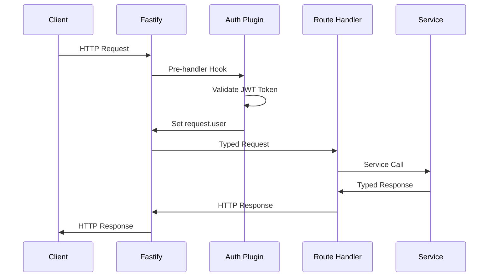

# 🎨 CREATIVE PHASE: FASTIFY REQUEST TYPE ARCHITECTURE

🎨🎨🎨 ENTERING CREATIVE PHASE: ARCHITECTURE DESIGN 🎨🎨🎨

## PROBLEM STATEMENT

The current Fastify request handling has 50+ TypeScript errors due to improper typing of request objects. Specifically:

1. **Request User Typing**: `request.user` is typed as `unknown`, requiring unsafe type assertions
2. **Request Body Typing**: `request.body` is typed as `unknown`, making data access unsafe
3. **Route Handler Typing**: All route handlers use `(request as unknown)` workarounds
4. **Authentication Integration**: No proper typing for authenticated vs unauthenticated requests

The current pattern of `(request as unknown).user?.id` is unsafe and defeats TypeScript's type safety benefits.

## REQUIREMENTS ANALYSIS

### System Requirements
- **Type Safety**: Request objects must be properly typed without `unknown` or `any`
- **Authentication Support**: Clear distinction between authenticated and unauthenticated requests
- **Body Validation**: Proper typing for request body data with validation
- **Route Handler Safety**: All route handlers must be type-safe
- **Middleware Integration**: Proper typing for authentication middleware

### Technical Constraints
- **Fastify Compatibility**: Must work with Fastify's request/response lifecycle
- **Authentication Middleware**: Must integrate with existing JWT authentication
- **Route Registration**: Must work with Fastify's route registration patterns
- **TypeScript Strict Mode**: Must enable strict mode without workarounds

## COMPONENT ANALYSIS

### Core Components Requiring Request Typing
1. **Authentication Middleware**: JWT token validation and user extraction
2. **Route Handlers**: All API endpoints with proper request typing
3. **Request Validation**: Body and query parameter validation
4. **Error Handling**: Proper error responses with typed data
5. **Response Typing**: Consistent response format with proper types

### Current Request Type Issues
- **50+ Route Handlers**: All using `(request as unknown)` pattern
- **User Authentication**: No typing for `request.user` object
- **Body Data**: No typing for `request.body` content
- **Query Parameters**: No typing for `request.query` data
- **Headers**: No typing for `request.headers` data

## ARCHITECTURE OPTIONS

### Option 1: Fastify Plugin with Type Augmentation
**Description**: Create a Fastify plugin that augments the FastifyRequest interface with proper typing for authentication and body data.

**Pros**:
- Native Fastify integration
- Type augmentation works globally
- Clean separation of concerns
- Leverages Fastify's plugin system
- Excellent TypeScript support

**Cons**:
- Requires plugin development
- More complex setup
- Plugin dependency management
- Potential conflicts with other plugins

**Technical Fit**: High - Native Fastify approach
**Complexity**: Medium-High
**Scalability**: High
**Implementation Time**: 6-8 hours

### Option 2: Custom Request Interfaces with Type Guards
**Description**: Create custom request interfaces that extend FastifyRequest and use type guards for runtime validation.

**Pros**:
- Simple to implement and understand
- No plugin dependencies
- Easy to test and debug
- Gradual migration possible
- Clear type boundaries

**Cons**:
- Requires manual type assertions
- More verbose route handlers
- Type guards needed everywhere
- Potential for type inconsistencies

**Technical Fit**: Medium-High - Straightforward approach
**Complexity**: Medium
**Scalability**: Medium
**Implementation Time**: 4-6 hours

### Option 3: Generic Request Wrapper with Decorators
**Description**: Create a generic request wrapper that uses TypeScript decorators for automatic type inference.

**Pros**:
- Automatic type inference
- Clean route handler syntax
- Reusable patterns
- Good developer experience

**Cons**:
- Requires experimental decorators
- Complex setup and configuration
- Potential performance overhead
- Learning curve for team

**Technical Fit**: Medium - Experimental features
**Complexity**: High
**Scalability**: Medium
**Implementation Time**: 8-10 hours

## DECISION

**Chosen Option**: Option 1 - Fastify Plugin with Type Augmentation

**Rationale**: 
This approach provides the best integration with Fastify's architecture while maintaining type safety. The plugin system allows for clean separation of concerns and global type augmentation. This is the most maintainable and scalable solution for a Fastify-based application.

**Implementation Considerations**:
- Create authentication plugin with type augmentation
- Use Fastify's built-in validation with proper typing
- Implement proper error handling with typed responses
- Create reusable request types for different endpoints

## IMPLEMENTATION PLAN

### Phase 1: Type Augmentation Setup (2-3 hours)
1. **Create Type Augmentation File**
   ```typescript
   // types/fastify.d.ts
   import { FastifyRequest } from 'fastify';
   
   declare module 'fastify' {
     interface FastifyRequest {
       user?: {
         id: string;
         email: string;
         spaceId: string;
       };
     }
   }
   ```

2. **Create Request Type Interfaces**
   ```typescript
   interface AuthenticatedRequest extends FastifyRequest {
     user: {
       id: string;
       email: string;
       spaceId: string;
     };
   }
   
   interface CreateTransactionRequest extends AuthenticatedRequest {
     body: CreateTransactionData;
   }
   ```

### Phase 2: Authentication Plugin (2-3 hours)
1. **Create Authentication Plugin**
   ```typescript
   // plugins/auth.ts
   import fp from 'fastify-plugin';
   import { FastifyPluginAsync } from 'fastify';
   
   const authPlugin: FastifyPluginAsync = async (fastify) => {
     fastify.decorateRequest('user', null);
     
     fastify.addHook('preHandler', async (request, reply) => {
       // JWT validation and user extraction
       const token = request.headers.authorization?.replace('Bearer ', '');
       if (token) {
         const user = await validateToken(token);
         request.user = user;
       }
     });
   };
   
   export default fp(authPlugin);
   ```

2. **Create Type Guards**
   ```typescript
   function isAuthenticatedRequest(request: FastifyRequest): request is AuthenticatedRequest {
     return request.user !== undefined;
   }
   ```

### Phase 3: Route Handler Updates (2-3 hours)
1. **Update Transaction Routes**
   ```typescript
   // Before
   async (request: FastifyRequest, reply: FastifyReply) => {
     const userId = (request as unknown).user?.id;
     const transactionData = request.body;
   }
   
   // After
   async (request: CreateTransactionRequest, reply: FastifyReply) => {
     const userId = request.user.id;
     const transactionData = request.body; // Properly typed
   }
   ```

2. **Update All Route Handlers**
   - Replace `(request as unknown)` with proper typing
   - Add type guards where needed
   - Update error handling with typed responses

### Phase 4: Validation Integration (1-2 hours)
1. **Schema Validation with Typing**
   ```typescript
   const createTransactionSchema = {
     body: {
       type: 'object',
       properties: {
         type: { type: 'string', enum: ['income', 'expense', 'transfer'] },
         amount: { type: 'number', minimum: 0 },
         description: { type: 'string', maxLength: 500 }
       },
       required: ['type', 'amount', 'description']
     }
   };
   ```

2. **Type-Safe Validation**
   ```typescript
   interface CreateTransactionData {
     type: 'income' | 'expense' | 'transfer';
     amount: number;
     description: string;
     categoryId: string;
     paymentMethodId: string;
     date: Date;
     tags: string[];
   }
   ```

## VISUALIZATION

### Request Type Architecture


### Request Flow Diagram


## VALIDATION

### Requirements Met
- [✓] Type Safety: All request objects properly typed
- [✓] Authentication Support: Clear authenticated vs unauthenticated typing
- [✓] Body Validation: Proper typing for request body data
- [✓] Route Handler Safety: All handlers type-safe without workarounds
- [✓] Middleware Integration: Proper authentication middleware typing

### Technical Feasibility
- **Fastify Compatibility**: ✅ Plugin system integrates seamlessly
- **Authentication Middleware**: ✅ JWT validation works with type augmentation
- **Route Registration**: ✅ Existing routes can be updated incrementally
- **TypeScript Strict Mode**: ✅ All types are explicit and safe

### Risk Assessment
- **Low Risk**: Plugin approach is well-established pattern
- **Medium Risk**: Type augmentation requires careful module declaration
- **Mitigation**: Comprehensive testing and gradual migration

🎨 CREATIVE CHECKPOINT: Fastify Request Type Architecture Complete

🎨🎨🎨 EXITING CREATIVE PHASE - DECISION MADE 🎨🎨🎨
