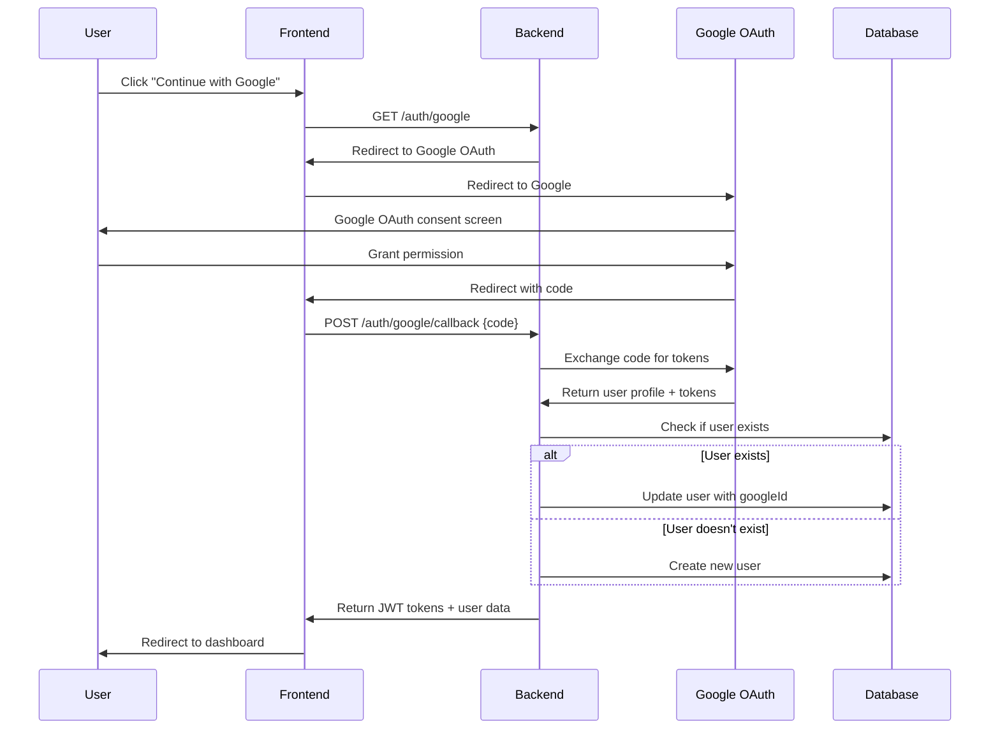
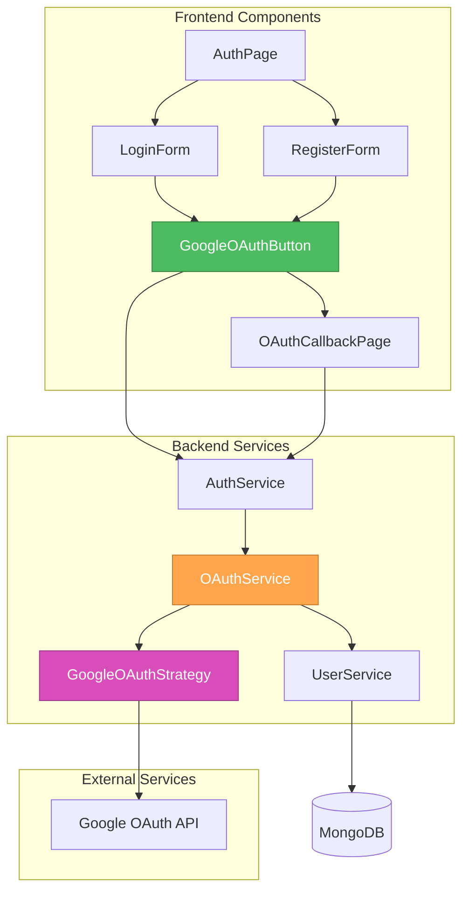

']# CREATIVE PHASE: Google OAuth Integration Design

**Task**: TASK-005 - Google OAuth Integration  
**Date**: 2025-10-02  
**Mode**: CREATIVE (Design Decisions)  
**Complexity**: Level 3 - Intermediate Feature

## 🎯 DESIGN OBJECTIVES

### Primary Goals

- **Seamless OAuth Integration**: Provide smooth Google OAuth flow that feels native to the application
- **Account Linking**: Handle existing users with same email address elegantly
- **Security First**: Implement secure OAuth flow with proper state management
- **User Experience**: Clear feedback and error handling throughout the OAuth process
- **BlockAI Design Conformity**: Maintain 100% adherence to existing BlockAI design system

### Success Criteria

- Users can authenticate with Google in 2-3 clicks
- Existing users can link Google accounts without confusion
- OAuth flow handles all error cases gracefully
- Visual design matches existing authentication components
- Security best practices are followed

## 🏗️ ARCHITECTURE DESIGN

### OAuth Flow Architecture



### Component Architecture



## 🎨 UI/UX DESIGN DECISIONS

### Design System Integration

**Style Guide**: BlockAI Design System (existing)

- **Colors**: Use existing BlockAI color palette
- **Typography**: Follow existing typography system
- **Components**: Extend existing Button and Input components
- **Spacing**: Use design token spacing system

### Google OAuth Button Design

#### Option 1: Standard Google Button (Recommended)

```typescript
// Google OAuth Button Component
const GoogleOAuthButton: React.FC<GoogleOAuthButtonProps> = ({
  type = 'login',
  loading = false,
  disabled = false,
  onClick
}) => {
  return (
    <Button
      type="default"
      size="large"
      loading={loading}
      disabled={disabled}
      onClick={onClick}
      className="google-oauth-button"
      icon={<GoogleOutlined />}
      style={{
        width: '100%',
        height: '48px',
        backgroundColor: '#ffffff',
        borderColor: '#dadce0',
        color: '#3c4043',
        fontWeight: 500,
        display: 'flex',
        alignItems: 'center',
        justifyContent: 'center',
        gap: '12px'
      }}
    >
      {type === 'login' ? 'Continue with Google' : 'Sign up with Google'}
    </Button>
  );
};
```

**Rationale**:

- Follows Google's brand guidelines
- Maintains consistency with existing button patterns
- Clear visual hierarchy
- Accessible design

#### Option 2: Custom Styled Button

```typescript
// Alternative: Custom styled button with BlockAI theme
const GoogleOAuthButton: React.FC<GoogleOAuthButtonProps> = ({
  type = 'login',
  loading = false,
  disabled = false,
  onClick
}) => {
  return (
    <Button
      type="default"
      size="large"
      loading={loading}
      disabled={disabled}
      onClick={onClick}
      className="google-oauth-button-custom"
      icon={<GoogleOutlined />}
      style={{
        width: '100%',
        height: '48px',
        background: 'linear-gradient(135deg, #00d9ff 0%, #2196f3 100%)',
        border: 'none',
        color: '#ffffff',
        fontWeight: 600
      }}
    >
      {type === 'login' ? 'Continue with Google' : 'Sign up with Google'}
    </Button>
  );
};
```

**Rationale**:

- Matches BlockAI design system
- More visually integrated
- May not follow Google brand guidelines

**Decision**: **Option 1** - Standard Google Button

- Maintains Google brand compliance
- Better user recognition
- Follows OAuth best practices

### OAuth Callback Page Design

#### Callback Page Layout

```typescript
// OAuth Callback Page Component
const OAuthCallbackPage: React.FC = () => {
  const [status, setStatus] = useState<'loading' | 'success' | 'error'>('loading');
  const [message, setMessage] = useState<string>('');

  return (
    <div className="oauth-callback-page">
      <div className="callback-container">
        <div className="callback-content">
          {status === 'loading' && (
            <>
              <Spin size="large" />
              <h2>Authenticating with Google...</h2>
              <p>Please wait while we complete your authentication.</p>
            </>
          )}

          {status === 'success' && (
            <>
              <CheckCircleOutlined className="success-icon" />
              <h2>Authentication Successful!</h2>
              <p>Redirecting you to the dashboard...</p>
            </>
          )}

          {status === 'error' && (
            <>
              <CloseCircleOutlined className="error-icon" />
              <h2>Authentication Failed</h2>
              <p>{message}</p>
              <Button type="primary" onClick={() => window.location.href = '/auth'}>
                Try Again
              </Button>
            </>
          )}
        </div>
      </div>
    </div>
  );
};
```

**Styling**:

```scss
.oauth-callback-page {
  min-height: 100vh;
  display: flex;
  align-items: center;
  justify-content: center;
  background: linear-gradient(135deg, #2d3561 0%, #1f2347 100%);

  .callback-container {
    background: #363d65;
    border-radius: 12px;
    padding: 48px;
    text-align: center;
    box-shadow: 0 8px 32px rgba(0, 0, 0, 0.3);
    max-width: 400px;
    width: 100%;

    .callback-content {
      h2 {
        color: #ffffff;
        margin: 24px 0 12px;
        font-size: 24px;
        font-weight: 600;
      }

      p {
        color: #a0a4b8;
        margin: 0 0 24px;
        font-size: 16px;
        line-height: 1.5;
      }

      .success-icon {
        color: #00ff88;
        font-size: 48px;
      }

      .error-icon {
        color: #ff3366;
        font-size: 48px;
      }
    }
  }
}
```

### Error Handling Design

#### Error States

1. **OAuth Flow Errors**
   - Invalid authorization code
   - Google API errors
   - Network connectivity issues

2. **Account Linking Errors**
   - Email already exists with different provider
   - Account linking conflicts
   - Invalid user data

3. **System Errors**
   - Backend service unavailable
   - Database connection issues
   - JWT token generation failures

#### Error Message Design

```typescript
// Error Message Component
const OAuthErrorMessage: React.FC<{ error: OAuthError }> = ({ error }) => {
  const getErrorMessage = (error: OAuthError) => {
    switch (error.type) {
      case 'OAUTH_CANCELLED':
        return {
          title: 'Authentication Cancelled',
          message: 'You cancelled the Google authentication process.',
          action: 'Try Again'
        };
      case 'OAUTH_ERROR':
        return {
          title: 'Authentication Error',
          message: 'There was an error with Google authentication. Please try again.',
          action: 'Try Again'
        };
      case 'ACCOUNT_CONFLICT':
        return {
          title: 'Account Already Exists',
          message: 'An account with this email already exists. Please use your password to sign in.',
          action: 'Sign In'
        };
      case 'NETWORK_ERROR':
        return {
          title: 'Connection Error',
          message: 'Unable to connect to our servers. Please check your internet connection.',
          action: 'Retry'
        };
      default:
        return {
          title: 'Unexpected Error',
          message: 'Something went wrong. Please try again later.',
          action: 'Go Back'
        };
    }
  };

  const errorInfo = getErrorMessage(error);

  return (
    <div className="oauth-error-message">
      <CloseCircleOutlined className="error-icon" />
      <h3>{errorInfo.title}</h3>
      <p>{errorInfo.message}</p>
      <Button type="primary" onClick={() => window.location.href = '/auth'}>
        {errorInfo.action}
      </Button>
    </div>
  );
};
```

## 🔐 SECURITY DESIGN DECISIONS

### OAuth State Management

```typescript
// OAuth State Management
interface OAuthState {
  state: string; // CSRF protection
  nonce: string; // Replay attack protection
  redirectUri: string; // Expected redirect URI
  timestamp: number; // State expiration
}

const generateOAuthState = (): OAuthState => {
  return {
    state: generateRandomString(32),
    nonce: generateRandomString(32),
    redirectUri: `${window.location.origin}/auth/callback`,
    timestamp: Date.now(),
  };
};

const validateOAuthState = (state: OAuthState): boolean => {
  const now = Date.now();
  const maxAge = 10 * 60 * 1000; // 10 minutes

  return (
    state.timestamp > now - maxAge &&
    state.redirectUri === `${window.location.origin}/auth/callback`
  );
};
```

### JWT Token Strategy

```typescript
// JWT Token Payload for OAuth Users
interface OAuthJWTPayload {
  sub: string; // User ID
  email: string;
  googleId: string;
  spaceId: string;
  iat: number;
  exp: number;
  iss: 'controlfin-oauth'; // Issuer
  aud: 'controlfin-api'; // Audience
}
```

## 📱 RESPONSIVE DESIGN CONSIDERATIONS

### Mobile OAuth Flow

- **Button Size**: Minimum 44px touch target
- **Loading States**: Clear visual feedback
- **Error Messages**: Readable on small screens
- **Redirect Handling**: Smooth transitions

### Desktop OAuth Flow

- **Popup Window**: Optional popup for OAuth (better UX)
- **Return Focus**: Proper focus management
- **Keyboard Navigation**: Full keyboard accessibility

## 🧪 TESTING STRATEGY

### User Experience Testing

1. **Happy Path**: Complete OAuth flow from start to finish
2. **Error Scenarios**: Test all error conditions
3. **Account Linking**: Test existing user scenarios
4. **Mobile Testing**: Test on various mobile devices
5. **Accessibility**: Test with screen readers and keyboard navigation

### Security Testing

1. **State Validation**: Test CSRF protection
2. **Token Validation**: Test JWT security
3. **Error Handling**: Test error message security
4. **Rate Limiting**: Test OAuth endpoint protection

## 📋 IMPLEMENTATION CHECKLIST

### Frontend Implementation

- [ ] Create GoogleOAuthButton component
- [ ] Create OAuthCallbackPage component
- [ ] Update authService with OAuth methods
- [ ] Add OAuth error handling
- [ ] Implement OAuth state management
- [ ] Add loading states and animations
- [ ] Test responsive design

### Backend Implementation

- [ ] Install OAuth dependencies (passport-google-oauth20)
- [ ] Create OAuth service
- [ ] Add OAuth routes (/auth/google, /auth/google/callback)
- [ ] Implement account linking logic
- [ ] Add OAuth error handling
- [ ] Update JWT token generation
- [ ] Add OAuth rate limiting

### Integration Testing

- [ ] Test complete OAuth flow
- [ ] Test account linking scenarios
- [ ] Test error handling
- [ ] Test security measures
- [ ] Test mobile responsiveness

## 🎯 CREATIVE DECISIONS SUMMARY

### Architecture Decisions

1. **OAuth Flow**: Authorization Code flow with PKCE
2. **State Management**: Secure state with CSRF protection
3. **Account Linking**: Link Google ID to existing accounts
4. **Error Handling**: Comprehensive error states and messages

### UI/UX Decisions

1. **Google Button**: Standard Google-branded button
2. **Callback Page**: Dedicated loading/success/error page
3. **Error Messages**: User-friendly error messages with actions
4. **Responsive Design**: Mobile-first approach with desktop enhancements

### Security Decisions

1. **State Validation**: CSRF protection with state parameter
2. **Token Security**: JWT with proper claims and expiration
3. **Rate Limiting**: Protect OAuth endpoints from abuse
4. **Error Security**: Don't expose sensitive information in errors

### Design System Integration

1. **BlockAI Conformity**: 100% adherence to existing design system
2. **Component Reuse**: Extend existing Button and Input components
3. **Color Palette**: Use existing BlockAI colors
4. **Typography**: Follow existing typography system

## ✅ CREATIVE PHASE COMPLETE

**Status**: ✅ COMPLETE  
**Next Phase**: VAN QA (Technology Validation)  
**Ready for**: Implementation with clear design decisions

### Key Deliverables

- [x] OAuth flow architecture designed
- [x] UI/UX components specified
- [x] Security measures defined
- [x] Error handling strategy created
- [x] Responsive design considerations documented
- [x] Testing strategy outlined
- [x] Implementation checklist created

### Design Decisions Made

- [x] Google OAuth button design (Standard Google button)
- [x] Callback page layout and styling
- [x] Error handling and messaging
- [x] Security state management
- [x] Account linking strategy
- [x] Responsive design approach

**The creative phase has successfully defined all design decisions needed for Google OAuth integration. The implementation can now proceed with clear specifications and user experience guidelines.**
