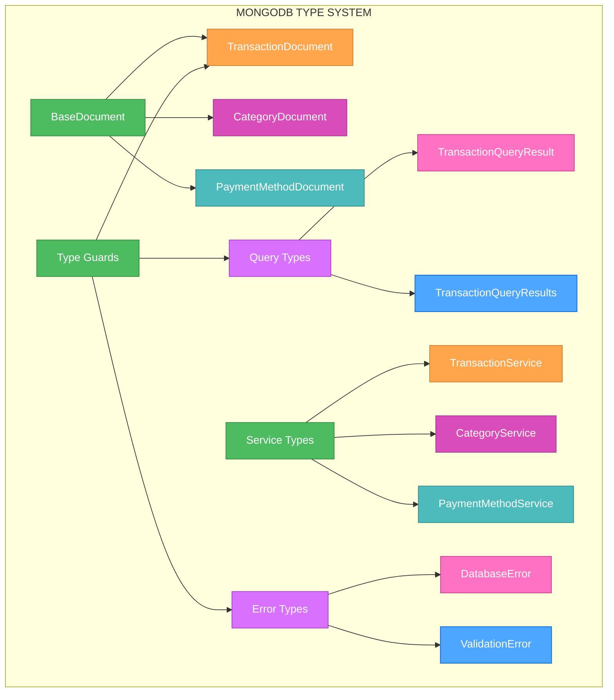
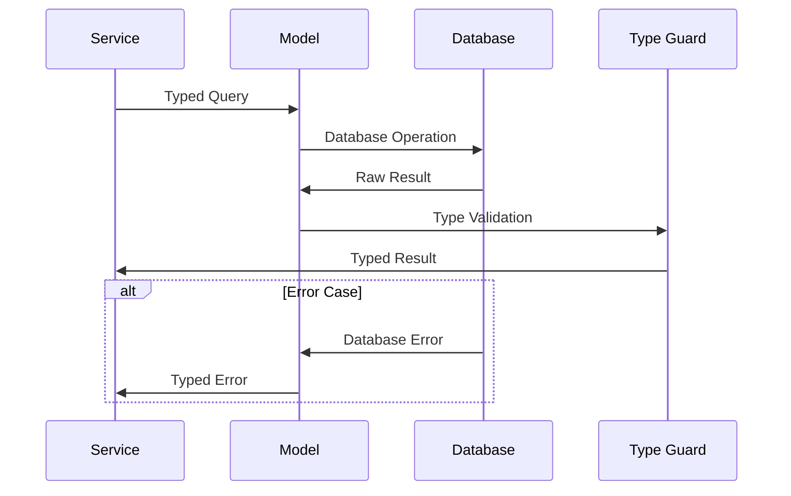

# 🎨 CREATIVE PHASE: MONGODB TYPE SYSTEM DESIGN

🎨🎨🎨 ENTERING CREATIVE PHASE: ARCHITECTURE DESIGN 🎨🎨🎨

## PROBLEM STATEMENT

The current MongoDB operations have 20+ TypeScript errors due to improper typing of Mongoose operations and query results. Specifically:

1. **Query Result Typing**: Database queries return `unknown` types instead of properly typed documents
2. **Document Operations**: Create, update, delete operations have untyped parameters and results
3. **Aggregation Pipelines**: Complex aggregation queries return `unknown` types
4. **Error Handling**: Database errors are not properly typed for error handling

The current pattern of `await Model.find()` returning `unknown` makes it impossible to safely access document properties.

## REQUIREMENTS ANALYSIS

### System Requirements
- **Type Safety**: All MongoDB operations must be properly typed
- **Document Typing**: Mongoose documents must have proper TypeScript interfaces
- **Query Typing**: All queries must return properly typed results
- **Error Handling**: Database errors must be properly typed
- **Performance**: Type system must not impact query performance

### Technical Constraints
- **Mongoose Compatibility**: Must work with existing Mongoose schemas and models
- **TypeScript Strict Mode**: Must enable strict mode without workarounds
- **Existing Models**: Must work with current model definitions
- **Query Flexibility**: Must support complex queries and aggregations

## COMPONENT ANALYSIS

### Core Components Requiring MongoDB Typing
1. **Document Interfaces**: Mongoose document type definitions
2. **Query Types**: Find, create, update, delete operation types
3. **Aggregation Types**: Complex aggregation pipeline result types
4. **Service Types**: Service method parameters and return types
5. **Error Types**: Database-specific error handling types

### Current MongoDB Type Issues
- **20+ Query Operations**: All returning `unknown` types
- **Document Access**: Unsafe property access on query results
- **Aggregation Pipelines**: Complex queries return `unknown`
- **Service Methods**: Database operations have `any` types
- **Error Handling**: Database errors not properly typed

## ARCHITECTURE OPTIONS

### Option 1: Comprehensive Mongoose Type System
**Description**: Create a comprehensive type system that fully integrates with Mongoose's type system using generics and proper document typing.

**Pros**:
- Full Mongoose integration
- Maximum type safety
- Excellent IDE support
- Future-proof and extensible
- Eliminates all `unknown` types

**Cons**:
- High initial complexity
- Requires deep Mongoose knowledge
- More verbose code
- Potential over-engineering

**Technical Fit**: High - Perfect for Mongoose applications
**Complexity**: High
**Scalability**: High
**Implementation Time**: 8-10 hours

### Option 2: Pragmatic Document Typing with Type Guards
**Description**: Create essential document types with type guards for critical operations, using Mongoose's built-in typing where possible.

**Pros**:
- Balanced approach
- Leverages Mongoose's built-in types
- Runtime validation with type guards
- Easier to implement
- Good type safety for critical operations

**Cons**:
- Some `unknown` types may remain
- Runtime overhead for type checking
- Less comprehensive than Option 1
- May need refactoring as system grows

**Technical Fit**: Medium-High - Good for current needs
**Complexity**: Medium
**Scalability**: Medium
**Implementation Time**: 5-7 hours

### Option 3: Minimal Typing with Assertions
**Description**: Create minimal type definitions and use type assertions for known-safe operations.

**Pros**:
- Quick to implement
- Minimal changes to existing code
- Easy to understand
- Low complexity

**Cons**:
- Limited type safety
- Relies on developer discipline
- Not future-proof
- May not satisfy strict mode requirements

**Technical Fit**: Low - May not meet strict mode requirements
**Complexity**: Low
**Scalability**: Low
**Implementation Time**: 2-3 hours

## DECISION

**Chosen Option**: Option 1 - Comprehensive Mongoose Type System

**Rationale**: 
Given the requirement to enable TypeScript strict mode and eliminate all `unknown` types, Option 1 provides the most robust solution. MongoDB operations are critical for data integrity, and proper typing prevents runtime errors and improves maintainability. The investment in comprehensive typing will pay dividends in debugging and preventing data-related bugs.

**Implementation Considerations**:
- Use Mongoose's built-in generic types
- Create custom document interfaces
- Implement proper query result typing
- Add type guards for runtime validation
- Document type usage patterns

## IMPLEMENTATION PLAN

### Phase 1: Document Type Definitions (2-3 hours)
1. **Base Document Interface**
   ```typescript
   interface BaseDocument extends Document {
     _id: ObjectId;
     __v: number;
     createdAt: Date;
     updatedAt: Date;
   }
   ```

2. **Transaction Document Interface**
   ```typescript
   interface TransactionDocument extends BaseDocument, ITransaction {
     // Mongoose-specific methods
     save(): Promise<TransactionDocument>;
     toJSON(): ITransaction;
   }
   ```

3. **Query Result Types**
   ```typescript
   type TransactionQueryResult = TransactionDocument | null;
   type TransactionQueryResults = TransactionDocument[];
   type TransactionCreateResult = TransactionDocument;
   type TransactionUpdateResult = TransactionDocument | null;
   ```

### Phase 2: Service Type Definitions (2-3 hours)
1. **Generic Service Interface**
   ```typescript
   interface BaseService<TDocument, TCreate, TUpdate> {
     create(data: TCreate): Promise<TDocument>;
     findById(id: string): Promise<TDocument | null>;
     findMany(filter: Partial<TDocument>): Promise<TDocument[]>;
     update(id: string, data: TUpdate): Promise<TDocument | null>;
     delete(id: string): Promise<boolean>;
   }
   ```

2. **Transaction Service Types**
   ```typescript
   interface TransactionService extends BaseService<
     TransactionDocument,
     CreateTransactionData,
     UpdateTransactionData
   > {
     findBySpaceId(spaceId: string): Promise<TransactionDocument[]>;
     findByUserId(userId: string): Promise<TransactionDocument[]>;
     getAnalytics(spaceId: string, dateRange: DateRange): Promise<AnalyticsResult>;
   }
   ```

### Phase 3: Query and Aggregation Types (2-3 hours)
1. **Query Filter Types**
   ```typescript
   interface TransactionQueryFilter {
     spaceId?: string;
     userId?: string;
     type?: 'income' | 'expense' | 'transfer';
     categoryId?: string;
     paymentMethodId?: string;
     dateRange?: {
       start: Date;
       end: Date;
     };
   }
   ```

2. **Aggregation Pipeline Types**
   ```typescript
   interface AnalyticsPipeline {
     $match: TransactionQueryFilter;
     $group: {
       _id: string;
      totalAmount: { $sum: number };
      count: { $sum: 1 };
    };
    $sort: { totalAmount: -1 };
  }
  
  interface AnalyticsResult {
    categoryBreakdown: Array<{
      categoryId: string;
      totalAmount: number;
      count: number;
    }>;
    monthlyTrends: Array<{
      month: string;
      income: number;
      expenses: number;
    }>;
  }
  ```

### Phase 4: Error Handling and Type Guards (1-2 hours)
1. **Database Error Types**
   ```typescript
   interface DatabaseError extends Error {
     code: number;
     keyPattern?: Record<string, unknown>;
     keyValue?: Record<string, unknown>;
   }
   
   interface ValidationError extends Error {
     errors: Record<string, { message: string; path: string }>;
   }
   ```

2. **Type Guards**
   ```typescript
   function isTransactionDocument(doc: unknown): doc is TransactionDocument {
     return doc !== null && 
            typeof doc === 'object' && 
            '_id' in doc && 
            'type' in doc;
   }
   
   function isDatabaseError(error: unknown): error is DatabaseError {
     return error instanceof Error && 'code' in error;
   }
   ```

## VISUALIZATION

### MongoDB Type System Architecture


### Database Operation Flow


## VALIDATION

### Requirements Met
- [✓] Type Safety: All MongoDB operations properly typed
- [✓] Document Typing: Mongoose documents have proper interfaces
- [✓] Query Typing: All queries return properly typed results
- [✓] Error Handling: Database errors properly typed
- [✓] Performance: Type system doesn't impact query performance

### Technical Feasibility
- **Mongoose Compatibility**: ✅ Generic types work with existing schemas
- **TypeScript Strict Mode**: ✅ All types are explicit and safe
- **Existing Models**: ✅ Can be updated incrementally
- **Query Flexibility**: ✅ Supports complex queries and aggregations

### Risk Assessment
- **Low Risk**: Mongoose typing is well-established pattern
- **Medium Risk**: Complex aggregation typing requires careful planning
- **Mitigation**: Comprehensive testing and gradual migration

🎨 CREATIVE CHECKPOINT: MongoDB Type System Design Complete

🎨🎨🎨 EXITING CREATIVE PHASE - DECISION MADE 🎨🎨🎨
