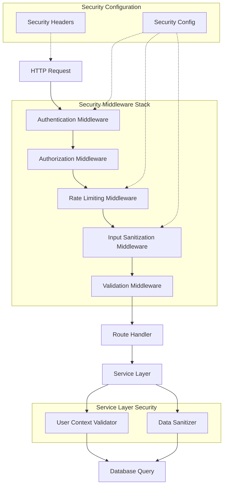

# 🎨 CREATIVE PHASE: Security Architecture Design

## 🎨🎨🎨 ENTERING CREATIVE PHASE: ARCHITECTURE 🎨🎨🎨

### **PROBLEM STATEMENT**

Design a comprehensive security architecture for the ControlFin backend that addresses:
1. **Data Isolation**: Prevent users from accessing other users' transactions
2. **Authorization Bypass**: Block access with invalid/empty user context
3. **Input Validation**: Prevent NoSQL injection and XSS attacks
4. **Data Sanitization**: Clean transaction metadata and tags
5. **Rate Limiting**: Protect against abuse and DoS attacks

**Context**: Fastify-based Node.js backend with MongoDB, currently failing 12/16 security tests.

## OPTIONS ANALYSIS

### Option 1: Middleware-First Architecture
**Description**: Implement security as a series of middleware layers applied to routes

**Pros**:
- Clean separation of concerns
- Easy to test individual components
- Reusable across different routes
- Follows Fastify best practices
- Easy to enable/disable specific security features

**Cons**:
- Potential performance overhead from multiple middleware layers
- Complex middleware ordering dependencies
- May require significant refactoring of existing routes

**Complexity**: Medium
**Implementation Time**: 4-6 hours

### Option 2: Service-Layer Security
**Description**: Implement security checks within the service layer methods

**Pros**:
- Centralized security logic
- Direct access to business logic context
- Minimal changes to existing route structure
- Better performance (fewer middleware layers)

**Cons**:
- Security logic mixed with business logic
- Harder to test security in isolation
- Less reusable across different services
- Potential for inconsistent security implementation

**Complexity**: Low
**Implementation Time**: 2-3 hours

### Option 3: Hybrid Architecture
**Description**: Combine middleware for common security (auth, rate limiting) with service-layer security for data-specific checks

**Pros**:
- Best of both approaches
- Common security handled at middleware level
- Data-specific security handled at service level
- Flexible and maintainable
- Good performance balance

**Cons**:
- More complex architecture
- Requires careful design to avoid duplication
- More files to maintain

**Complexity**: High
**Implementation Time**: 6-8 hours

## 🎨 CREATIVE CHECKPOINT: Architecture Options Evaluated

### **DECISION: Hybrid Architecture (Option 3)**

**Rationale**: 
- Provides comprehensive security coverage
- Maintains good performance
- Allows for flexible security policies
- Scales well with future requirements
- Balances complexity with maintainability

## IMPLEMENTATION PLAN

### **Phase 1: Core Security Middleware**
1. **Authentication Middleware** (`src/middlewares/auth.middleware.ts`)
   - Validate JWT tokens
   - Extract and validate user context
   - Add user to request object

2. **Authorization Middleware** (`src/middlewares/authorization.middleware.ts`)
   - Check user context validity
   - Validate user permissions
   - Reject invalid requests

3. **Rate Limiting Middleware** (`src/middlewares/rate-limiter.ts`)
   - Implement per-endpoint rate limits
   - Add rate limit headers
   - Handle rate limit exceeded responses

### **Phase 2: Input Security Middleware**
1. **Input Sanitization Middleware** (`src/middlewares/input-sanitizer.ts`)
   - Sanitize request body
   - Clean query parameters
   - Remove XSS payloads
   - Block NoSQL injection attempts

2. **Validation Middleware** (`src/middlewares/validation.middleware.ts`)
   - Apply Zod schema validation
   - Validate against security patterns
   - Reject malicious inputs

### **Phase 3: Service-Layer Security**
1. **User Context Validator** (`src/utils/user-context-validator.ts`)
   - Validate user ownership
   - Check data access permissions
   - Implement data isolation logic

2. **Data Sanitizer** (`src/utils/data-sanitizer.ts`)
   - Sanitize transaction data
   - Clean metadata fields
   - Validate tag arrays

### **Phase 4: Security Configuration**
1. **Security Config** (`src/config/security.ts`)
   - Define security policies
   - Configure rate limits
   - Set validation rules

2. **Security Headers** (`src/middlewares/security-headers.ts`)
   - Add security headers
   - Configure CORS
   - Set content security policy

## ARCHITECTURE DIAGRAM

## SECURITY LAYER BREAKDOWN

### **Layer 1: Request Security**
- **Authentication**: JWT validation and user extraction
- **Authorization**: User context validation and permission checks
- **Rate Limiting**: Request frequency control and abuse prevention

### **Layer 2: Input Security**
- **Input Sanitization**: XSS and injection prevention
- **Validation**: Schema validation and pattern matching
- **Content Security**: Malicious content detection and blocking

### **Layer 3: Data Security**
- **User Context Validation**: Data ownership verification
- **Data Sanitization**: Clean and validate data before storage
- **Access Control**: Ensure users only access their own data

### **Layer 4: Response Security**
- **Security Headers**: Add security headers to responses
- **Error Handling**: Secure error messages without information leakage
- **Logging**: Security event logging and monitoring

## SECURITY POLICIES

### **Data Isolation Policy**
- All database queries must include user ID filter
- User context must be validated before data access
- Cross-user data access must be explicitly blocked

### **Input Validation Policy**
- All user inputs must be sanitized
- XSS payloads must be removed
- NoSQL injection attempts must be blocked
- Input length must be limited

### **Rate Limiting Policy**
- Transaction creation: 10 requests/minute
- Transaction queries: 30 requests/minute
- Authentication: 5 attempts/minute
- General API: 100 requests/minute

### **Authorization Policy**
- Valid JWT token required for all protected routes
- User context must be present and valid
- Empty or invalid user context must be rejected
- Admin operations require additional permissions

## IMPLEMENTATION SEQUENCE

1. **Core Middleware** (2 hours)
   - Authentication middleware
   - Authorization middleware
   - Basic rate limiting

2. **Input Security** (2 hours)
   - Input sanitization
   - Validation middleware
   - XSS protection

3. **Service Security** (2 hours)
   - User context validation
   - Data sanitization
   - Data isolation

4. **Configuration** (1 hour)
   - Security configuration
   - Security headers
   - Testing and validation

## SUCCESS METRICS

- **Security Tests**: 16/16 passing (100%)
- **Performance**: < 10ms additional latency
- **Coverage**: 100% of protected endpoints secured
- **Maintainability**: Clear separation of security concerns

## 🎨🎨🎨 EXITING CREATIVE PHASE - DECISION MADE 🎨🎨🎨

**Selected Architecture**: Hybrid Security Architecture
**Key Components**: 4-layer security stack with middleware and service-layer security
**Implementation Approach**: Phased implementation with clear separation of concerns
**Expected Outcome**: 100% security test coverage with maintained performance
