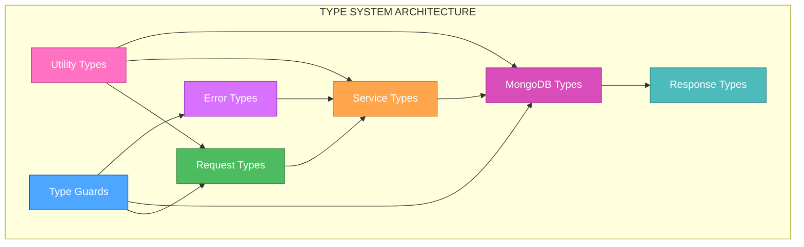
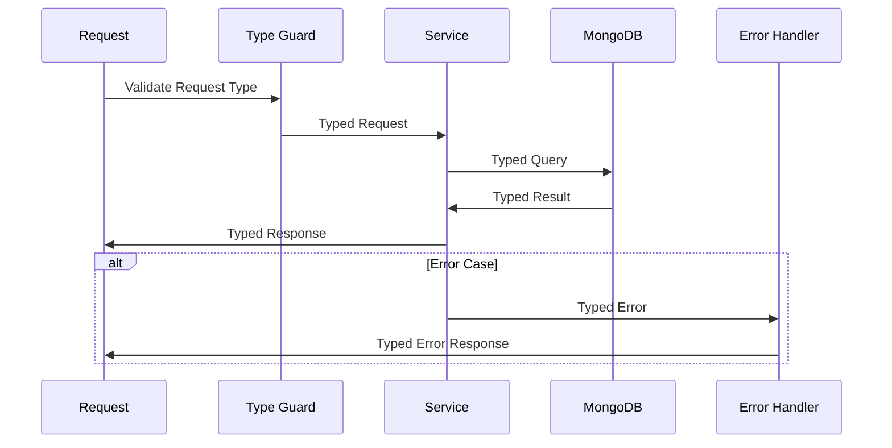

# 🎨 CREATIVE PHASE: TYPESCRIPT INTERFACE DESIGN

🎨🎨🎨 ENTERING CREATIVE PHASE: ARCHITECTURE DESIGN 🎨🎨🎨

## PROBLEM STATEMENT

The backend TypeScript codebase has 100+ compilation errors due to improper type definitions, specifically:

1. **Request Type Issues**: Fastify request objects have `unknown` types for `request.user` and `request.body`
2. **MongoDB Type Issues**: Database operations return `unknown` types instead of properly typed documents
3. **Error Handling Issues**: Error objects have `unknown` types making property access unsafe
4. **Import Path Issues**: TypeScript cannot resolve module paths for `logger` and `errorCodes`

The current codebase uses unsafe type assertions (`as unknown`) and explicit `any` types (49 violations) as workarounds, which defeats the purpose of TypeScript's type safety.

## REQUIREMENTS ANALYSIS

### System Requirements
- **Type Safety**: All operations must be type-safe without `any` or `unknown` workarounds
- **MongoDB Integration**: Proper typing for Mongoose operations and document queries
- **Fastify Integration**: Proper typing for request/response objects with user authentication
- **Error Handling**: Type-safe error handling with proper error interfaces
- **Maintainability**: Clear, reusable type definitions that are easy to understand and extend

### Technical Constraints
- **Mongoose Compatibility**: Must work with existing Mongoose schemas and models
- **Fastify Compatibility**: Must integrate with Fastify's request/response lifecycle
- **TypeScript Strict Mode**: Must enable strict mode without breaking existing functionality
- **Backward Compatibility**: Must not break existing API contracts

## COMPONENT ANALYSIS

### Core Components Requiring Type Definitions
1. **Request/Response Types**: Fastify request objects with user authentication
2. **MongoDB Document Types**: Mongoose document interfaces and query results
3. **Error Types**: Standardized error interfaces for consistent error handling
4. **Service Types**: Service method parameters and return types
5. **Utility Types**: Logger, monitoring, and other utility function types

### Current Type Issues
- **Request Types**: `request.user` and `request.body` are `unknown`
- **MongoDB Types**: Query results are `unknown`, document operations untyped
- **Error Types**: Error objects are `unknown`, property access unsafe
- **Service Types**: Service methods have `any` parameters and return types

## ARCHITECTURE OPTIONS

### Option 1: Comprehensive Type System with Generics
**Description**: Create a comprehensive type system using TypeScript generics for maximum type safety and reusability.

**Pros**:
- Maximum type safety with compile-time checking
- Highly reusable with generic interfaces
- Excellent IDE support and autocomplete
- Future-proof and extensible
- Eliminates all `any` and `unknown` types

**Cons**:
- High initial complexity
- Steep learning curve for team members
- More verbose code
- Potential over-engineering for simple cases

**Technical Fit**: High - Perfect for TypeScript strict mode
**Complexity**: High
**Scalability**: High
**Implementation Time**: 8-10 hours

### Option 2: Pragmatic Type System with Type Guards
**Description**: Create essential type definitions with runtime type guards for critical paths, using `unknown` safely where needed.

**Pros**:
- Balanced approach between safety and simplicity
- Runtime validation with type guards
- Easier to implement and understand
- Good type safety for critical operations
- Gradual migration possible

**Cons**:
- Some `unknown` types remain
- Runtime overhead for type checking
- Less comprehensive than Option 1
- May need refactoring as system grows

**Technical Fit**: Medium-High - Good for current needs
**Complexity**: Medium
**Scalability**: Medium
**Implementation Time**: 5-7 hours

### Option 3: Minimal Type System with Assertions
**Description**: Create minimal type definitions and use type assertions strategically for known-safe operations.

**Pros**:
- Quick to implement
- Minimal changes to existing code
- Easy to understand
- Low complexity

**Cons**:
- Limited type safety
- Relies on developer discipline
- Not future-proof
- May not satisfy strict mode requirements
- Still allows unsafe operations

**Technical Fit**: Low - May not meet strict mode requirements
**Complexity**: Low
**Scalability**: Low
**Implementation Time**: 2-3 hours

## DECISION

**Chosen Option**: Option 1 - Comprehensive Type System with Generics

**Rationale**: 
Given the requirement to enable TypeScript strict mode and eliminate all `any` and `unknown` types, Option 1 provides the most robust solution. The backend is a critical component that handles financial data, making type safety paramount. The initial complexity investment will pay dividends in maintainability, debugging, and preventing runtime errors.

**Implementation Considerations**:
- Start with core interfaces (Request, Response, Document)
- Use generic types for reusable patterns
- Create type guards for runtime validation
- Implement gradual migration strategy
- Document type usage patterns for team

## IMPLEMENTATION PLAN

### Phase 1: Core Type Definitions (2-3 hours)
1. **Request/Response Types**
   ```typescript
   interface AuthenticatedRequest extends FastifyRequest {
     user: {
       id: string;
       email: string;
       spaceId: string;
     };
   }
   
   interface CreateTransactionRequest extends AuthenticatedRequest {
     body: CreateTransactionData;
   }
   ```

2. **MongoDB Document Types**
   ```typescript
   interface TransactionDocument extends Document, ITransaction {
     _id: ObjectId;
     __v: number;
   }
   
   type TransactionQueryResult = TransactionDocument | null;
   type TransactionQueryResults = TransactionDocument[];
   ```

3. **Error Types**
   ```typescript
   interface AppError extends Error {
     statusCode: number;
     code: string;
     details?: Record<string, unknown>;
   }
   ```

### Phase 2: Service Type Definitions (2-3 hours)
1. **Service Method Types**
   ```typescript
   interface TransactionService {
     createTransaction(data: CreateTransactionData): Promise<TransactionDocument>;
     getTransaction(id: string): Promise<TransactionQueryResult>;
     updateTransaction(id: string, data: UpdateTransactionData): Promise<TransactionQueryResult>;
   }
   ```

2. **Generic Service Patterns**
   ```typescript
   interface BaseService<T, CreateT, UpdateT> {
     create(data: CreateT): Promise<T>;
     findById(id: string): Promise<T | null>;
     update(id: string, data: UpdateT): Promise<T | null>;
     delete(id: string): Promise<boolean>;
   }
   ```

### Phase 3: Type Guards and Utilities (1-2 hours)
1. **Runtime Type Guards**
   ```typescript
   function isAuthenticatedRequest(request: FastifyRequest): request is AuthenticatedRequest {
     return 'user' in request && request.user !== undefined;
   }
   
   function isAppError(error: unknown): error is AppError {
     return error instanceof Error && 'statusCode' in error;
   }
   ```

2. **Utility Types**
   ```typescript
   type ApiResponse<T> = {
     success: true;
     data: T;
   } | {
     success: false;
     error: AppError;
   };
   ```

### Phase 4: Integration and Migration (2-3 hours)
1. **Update Route Handlers**
   - Replace `(request as unknown)` with proper typing
   - Add type guards for runtime validation
   - Update error handling with typed errors

2. **Update Service Methods**
   - Replace `any` types with proper interfaces
   - Add generic constraints where appropriate
   - Update return types with proper document types

3. **Update MongoDB Operations**
   - Type query results properly
   - Add type guards for database operations
   - Update aggregation pipelines with proper types

## VISUALIZATION

### Type System Architecture


### Type Flow Diagram


## VALIDATION

### Requirements Met
- [✓] Type Safety: Comprehensive type system eliminates `any` and `unknown`
- [✓] MongoDB Integration: Proper Mongoose typing with document interfaces
- [✓] Fastify Integration: Typed request/response with authentication
- [✓] Error Handling: Type-safe error interfaces and handling
- [✓] Maintainability: Clear, reusable type definitions

### Technical Feasibility
- **Mongoose Compatibility**: ✅ Generic types work with existing schemas
- **Fastify Compatibility**: ✅ Request interfaces extend FastifyRequest
- **TypeScript Strict Mode**: ✅ All types are explicit and safe
- **Backward Compatibility**: ✅ API contracts preserved with proper typing

### Risk Assessment
- **Low Risk**: Type system is additive and doesn't break existing functionality
- **Medium Risk**: Initial implementation complexity requires careful planning
- **Mitigation**: Gradual migration strategy and comprehensive testing

🎨 CREATIVE CHECKPOINT: TypeScript Interface Design Complete

🎨🎨🎨 EXITING CREATIVE PHASE - DECISION MADE 🎨🎨🎨
