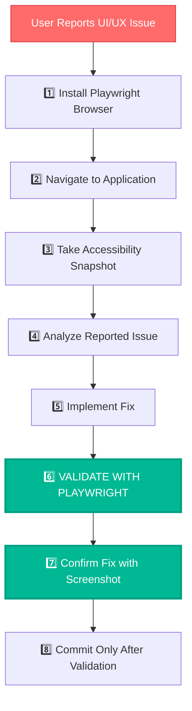

# UI/UX VALIDATION WORKFLOW - PLAYWRIGHT INTEGRATION

> **TL;DR:** When UI/UX issues are reported, ALWAYS use Playwright to validate the actual visual state before making any claims about fixes. Never make assumptions about visual fixes without browser validation.

## 🎯 UI/UX VALIDATION PROTOCOL

### **MANDATORY PLAYWRIGHT VALIDATION STEPS**



## 🔧 IMPLEMENTATION WORKFLOW

### **STEP 1: Browser Installation**

```bash
# Always install browser first
mcp_Playwright_browser_install
```

### **STEP 2: Navigation & Initial Validation**

```bash
# Navigate to the application
mcp_Playwright_browser_navigate(url="http://localhost:5174")

# Take initial snapshot to see current state
mcp_Playwright_browser_snapshot
```

### **STEP 3: Issue Analysis**

- Use snapshot to identify the exact visual problem
- Document the issue with specific details
- Never assume the problem without visual confirmation

### **STEP 4: Fix Implementation**

- Implement code changes based on visual analysis
- Make targeted fixes only
- Avoid broad changes without validation

### **STEP 5: MANDATORY VALIDATION**

```bash
# Navigate to updated application
mcp_Playwright_browser_navigate(url="http://localhost:5174")

# Take validation snapshot
mcp_Playwright_browser_snapshot

# Take screenshot for visual confirmation
mcp_Playwright_browser_take_screenshot(fullPage=true)
```

### **STEP 6: Fix Confirmation**

- Compare before/after snapshots
- Verify the specific issue is resolved
- Confirm no new issues introduced

### **STEP 7: Commit Only After Validation**

- Only commit after Playwright confirms the fix
- Include validation evidence in commit message
- Never commit based on assumptions

## 🚫 PROHIBITED ACTIONS

### **NEVER DO THESE:**

- ❌ Make claims about UI fixes without Playwright validation
- ❌ Commit changes without visual confirmation
- ❌ Assume problems are fixed based on code changes
- ❌ Skip browser validation for UI/UX issues
- ❌ Make broad changes without targeted validation

## ⚠️ WHEN PLAYWRIGHT IS NOT AVAILABLE

### **FALLBACK PROTOCOL:**

If Playwright browser cannot be connected:

1. **STOP**: Do not make any UI claims
2. **INFORM**: Tell user that Playwright validation is required
3. **REQUEST**: Ask user to manually verify the changes
4. **WAIT**: Do not commit until user confirms visual fix
5. **DOCUMENT**: Note in commit that manual validation was required

### **REQUIRED USER CONFIRMATION:**

```
⚠️ PLAYWRIGHT VALIDATION REQUIRED

I cannot connect to the Playwright browser to validate the UI changes.
Please manually verify the following:

1. Navigate to: http://localhost:5175
2. Check if the background blue gradient now covers the full screen
3. Confirm there are no dark borders around the edges
4. Verify the visual fix is working

Only after you confirm the fix is working should I proceed with the commit.
```

## ✅ REQUIRED ACTIONS

### **ALWAYS DO THESE:**

- ✅ Use Playwright for all UI/UX validation
- ✅ Take snapshots before and after changes
- ✅ Validate fixes with browser testing
- ✅ Document visual evidence in commits
- ✅ Confirm issues are actually resolved

## 📋 VALIDATION CHECKLIST

### **Before Making Any UI Claims:**

- [ ] Playwright browser installed
- [ ] Application navigated to
- [ ] Initial snapshot taken
- [ ] Issue visually confirmed
- [ ] Fix implemented
- [ ] Post-fix snapshot taken
- [ ] Screenshot captured
- [ ] Fix visually confirmed
- [ ] No new issues introduced

### **Commit Message Format:**

```
fix: [specific UI issue] - validated with Playwright

- Issue: [specific description of visual problem]
- Fix: [specific changes made]
- Validation: Playwright snapshot confirms resolution
- Screenshot: [reference to visual evidence]
```

## 🎯 EXAMPLE WORKFLOW

### **User Reports: "Background doesn't cover full screen"**

1. **Install Browser**: `mcp_Playwright_browser_install`
2. **Navigate**: `mcp_Playwright_browser_navigate(url="http://localhost:5174")`
3. **Initial Snapshot**: `mcp_Playwright_browser_snapshot`
4. **Analyze**: Confirm background issue in snapshot
5. **Fix**: Implement CSS changes
6. **Validate**:
   - `mcp_Playwright_browser_navigate(url="http://localhost:5174")`
   - `mcp_Playwright_browser_snapshot`
   - `mcp_Playwright_browser_take_screenshot(fullPage=true)`
7. **Confirm**: Verify background now covers full screen
8. **Commit**: Only after visual confirmation

## 🔄 INTEGRATION WITH EXISTING WORKFLOWS

This UI/UX validation workflow integrates with:

- **QA Mode**: Enhanced validation for UI components
- **IMPLEMENT Mode**: Visual validation during implementation
- **Memory Bank**: Document validation results

## 📊 SUCCESS METRICS

- ✅ All UI/UX issues validated with Playwright
- ✅ Zero commits without visual confirmation
- ✅ Accurate problem identification
- ✅ Targeted fixes without side effects
- ✅ User satisfaction with visual results

---

**🎯 CORE PRINCIPLE: NEVER CLAIM UI FIXES WITHOUT PLAYWRIGHT VALIDATION**
